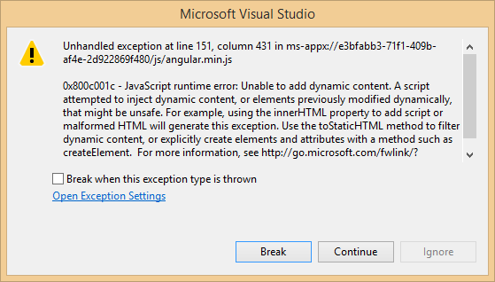

# `xdk-win8x-compat.js`

This JavaScript library is a concatenation of two parts, described below. These two parts 
can be used to help you make your Intel XDK Cordova app work on the Windows 8.x platform.
This library is not guaranteed to resolve all problems, but will help with many.

Reference the `xdk-win8x-compat.js` file near the beginning of your app; 
ideally, before any other scripts are run.

## JavaScript Dynamic Content Shim for Windows 8.x Store Apps

Enables JavaScript libraries that manipulate the DOM to work in Windows 8.x 
and Windows Phone 8.x webview apps. See <https://github.com/MSOpenTech/winstore-jscompat> 
for the original version of this shim. It has been modified and adapted for use with
apps built by the Intel XDK build system, but should work with Cordova CLI and
PhoneGap CLI built apps, as well.

In order to prevent unwanted access to the 
[Windows Runtime](http://msdn.microsoft.com/en-us/library/windows/desktop/br211377.aspx) 
a set of [restrictions and measures](http://msdn.microsoft.com/en-us/library/windows/apps/hh849625.aspx)
exist in Windows 8.x webviews to prevent malicious scripts from compromising an app's integrity. 
In some cases this security model prevents some JavaScript libraries to run as intended. A handful of 
popular, third-party libraries happen to use code which is flagged as unsafe and, therefore, do not 
work as expected in Windows 8.x webview apps. These libraries include but are not limited to:

* [jQuery](https://jquery.com/)
* [AngularJS](https://angularjs.org/)
* [Ember.js](http://emberjs.com/)
* [KnockoutJS](http://knockoutjs.com/).

An app that includes such a library might return the following error: 

> "JavaScript runtime error: Unable to add dynamic content. 
> A script attempted to inject dynamic content, or elements 
> previously modified dynamically, that might be unsafe."



Properties such as innerHTML and outerHTML are filtered in the Windows 8.x webviews
in order to avoid the common security issues that can result from the unsafe handling 
of untrusted data. In order to unblock these setbacks, Microsoft Open Technologies 
(MS Open Tech) released the
[JavaScript Dynamic Content shim for Windows Store apps](https://github.com/MSOpenTech/winstore-jscompat). 
This shim relaxes the manner in which checks are performed.

Use of this shim may have a minor impact on your app's performance.

> **NOTE:** You the dynamic content shim part of this file is not required for Windows 10 apps.

See also: [Running Cordova Apps on Windows and Windows Phone 8.1 using Ionic, AngularJS, and other Frameworks](http://blogs.msdn.com/b/msdn_answers/archive/2015/02/10/running-cordova-apps-on-windows-and-windows-phone-8-1-using-ionic-angularjs-and-other-frameworks.aspx)

## Windows 8.x Supplemental `alert()` Function

The Windows 8.x webview does not support the standard `alert()` method. Thus, a replacement
function is needed to supplement for the lack of `window.alert()` via the native (to Windows)
`Windows.UI.Popups.MessageDialog()` function. That function is normally used as shown:
```JavaScript
(new Windows.UI.Popups.MessageDialog("Content", "Title")).showAsync().done() ;
```
Note that the this replacement `alert()` function:

- Is not a blocking function like the familiar `window.alert()` function.
- This implementation queues up multiple alerts to simulate the `alert()` blocking behavior.

The replacement `alert()` function in this script will only be defined if a Windows webview
is detected. It will not attempt to replace the `alert()` on other webviews (such as Android,
Crosswalk and iOS). In those instances, the native `alert()` function will be used, as-is.
